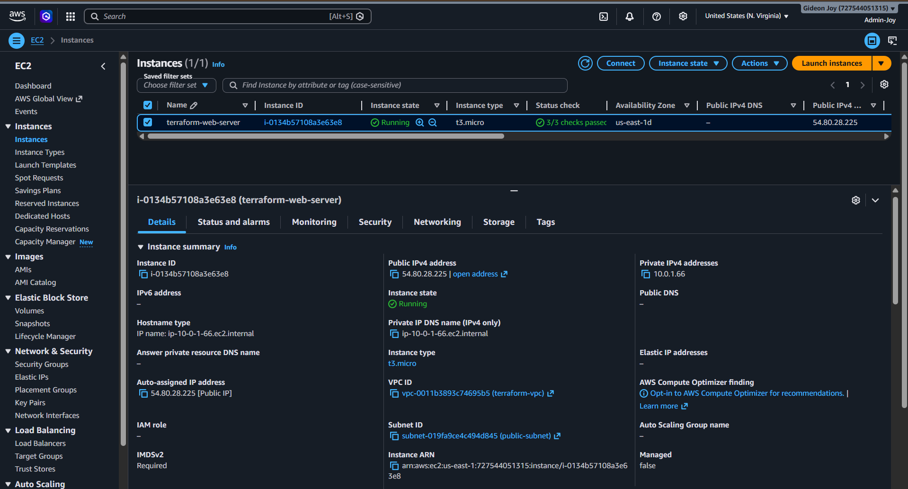
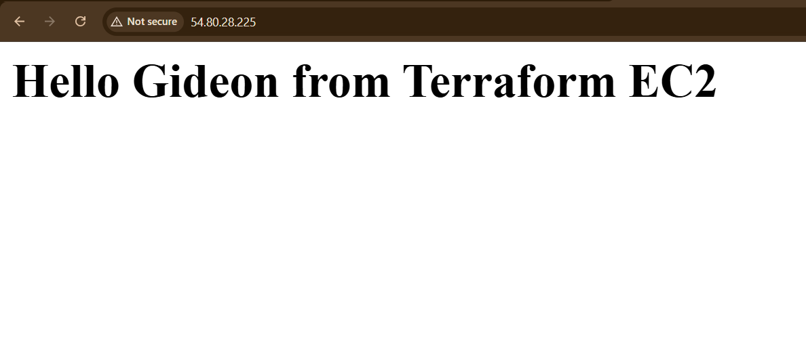
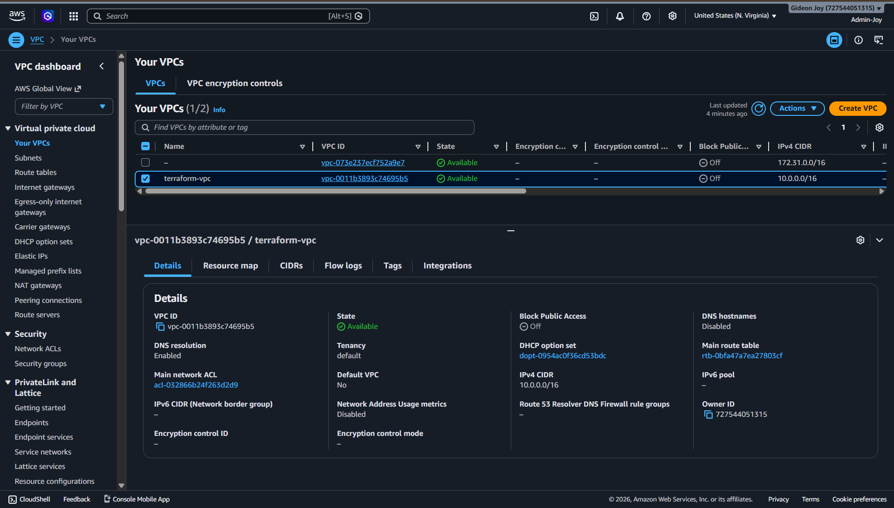
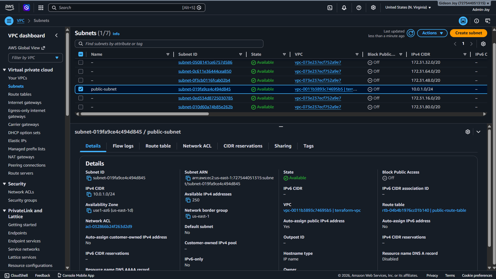
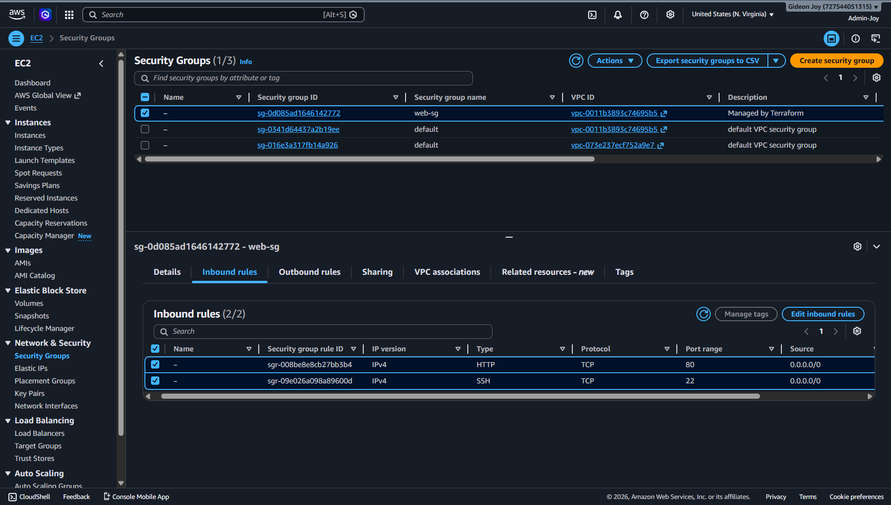
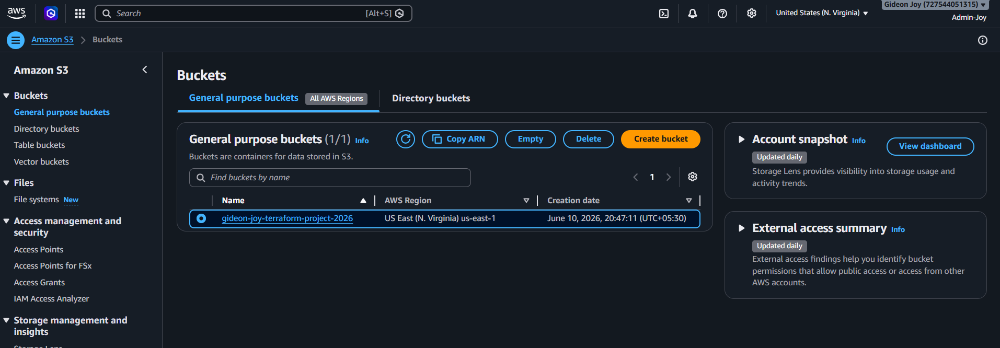
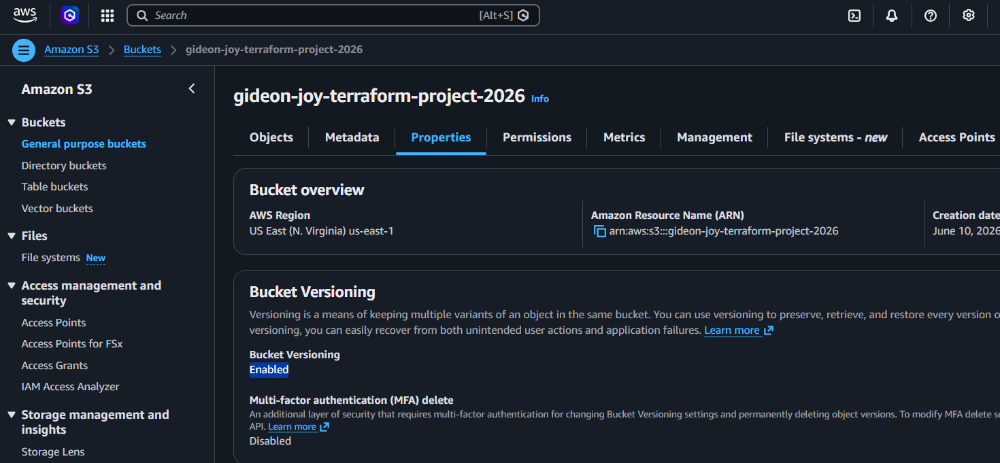
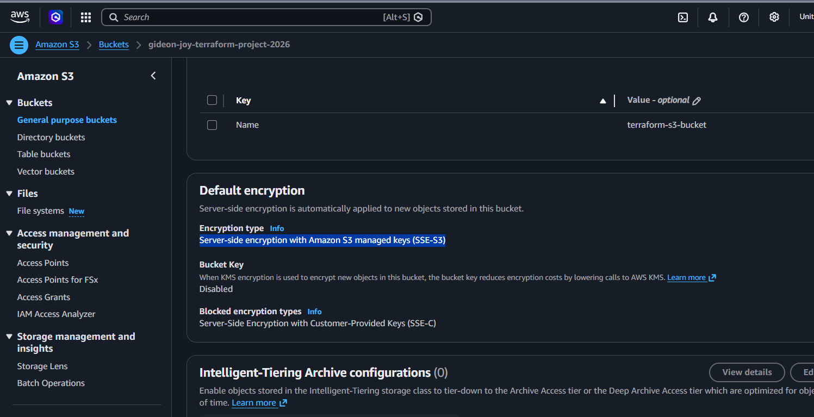
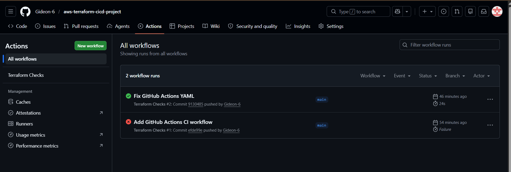
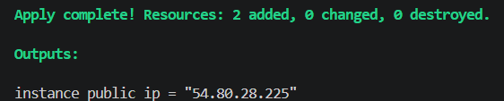

# ☁️ AWS Infrastructure Automation using Terraform

### 🧑‍💻 Author: Budidha Gideon Joy
**College:** TKR College of Engineering and Technology  
**Domain:** Cloud Computing, DevOps and Infrastructure as Code (IaC)  
**Duration:** 5 Days Project (Individual Project)

---

## 🏗️ Project Overview

This project demonstrates the implementation of a complete AWS cloud infrastructure using **Terraform** as Infrastructure as Code (IaC). The infrastructure includes networking, security, compute, storage, and CI/CD automation components deployed entirely through Terraform.

The project provisions a secure AWS environment consisting of a custom VPC, public subnet, Internet Gateway, route tables, security groups, an EC2 web server, and an Amazon S3 bucket with versioning, encryption, and lifecycle management.

Additionally, a **GitHub Actions CI/CD pipeline** automates Terraform formatting and validation checks on every code push.

---

## ⚙️ Architecture Overview

### 🔹 Infrastructure Flow

1. Users access the web application through the Internet.
2. Traffic enters AWS through the Internet Gateway.
3. Requests are routed to the Public Subnet within the custom VPC.
4. Security Groups control inbound and outbound traffic.
5. An EC2 instance hosts an Apache web server.
6. Amazon S3 provides secure object storage.
7. Terraform manages the entire infrastructure deployment.
8. GitHub Actions performs automated Terraform validation.

### 🧭 Architecture Diagram

---

## 📸 AWS Resource Validation Figures

### Figure 1: EC2 Instance Deployment

The EC2 instance was successfully provisioned using Terraform and deployed within the public subnet.

---

### Figure 2: Web Server Validation

The Apache web server was automatically configured using Terraform User Data and serves a custom webpage.

---

### Figure 3: VPC and Networking Resources

Custom networking resources including VPC, subnet, route table, and Internet Gateway were successfully provisioned.

---

### Figure 4: Public Subnet

The `public-subnet` was provisioned inside the custom VPC and configured to assign public IP addresses to resources, enabling internet connectivity through the Internet Gateway.
---

### Figure 5: Security Group

The `web-sg` Security Group permits HTTP (Port 80) and SSH (Port 22) access, enabling secure web server communication and remote management of the EC2 instance.
---

### Figure 6: Amazon S3 Bucket

The S3 bucket was deployed through Terraform with versioning enabled.

---

### Figure 7: S3 Versioning

Versioning is enabled on the S3 bucket, ensuring object history is maintained and enabling recovery from accidental deletions or overwrites.

---

### Figure 8: S3 Encryption Configuration

Server-side encryption (AES-256) is enabled for secure object storage.

---

### Figure 9: GitHub Actions CI/CD Pipeline

GitHub Actions automatically validates Terraform configurations whenever code is pushed to the repository.

---

### Figure 10: Terraform Apply Success

Terraform successfully provisioned the AWS resources and generated the EC2 public IP address. The infrastructure deployment completed without errors, confirming successful creation of the cloud environment.
---
## 🚀 Features

- ✅ Infrastructure as Code using Terraform
- ✅ Automated AWS resource provisioning
- ✅ Custom VPC and networking setup
- ✅ EC2 Web Server deployment
- ✅ Apache installation through User Data
- ✅ Amazon S3 bucket creation
- ✅ S3 Versioning enabled
- ✅ S3 AES-256 Encryption enabled
- ✅ S3 Lifecycle Policies configured
- ✅ GitHub Actions CI/CD integration
- ✅ Git version control

---

## 🧩 AWS Services Used

| Service | Purpose |
|----------|----------|
| **Amazon VPC** | Network isolation and segmentation |
| **Internet Gateway** | Internet access for AWS resources |
| **Route Tables** | Network traffic routing |
| **Security Groups** | Virtual firewall for EC2 |
| **Amazon EC2** | Web server hosting |
| **Amazon S3** | Object storage service |
| **Terraform** | Infrastructure provisioning |
| **GitHub Actions** | CI/CD automation |

---

## 🧱 Tech Stack

- Terraform
- AWS EC2
- AWS VPC
- AWS S3
- Git
- GitHub
- GitHub Actions
- Apache HTTP Server
- AWS CLI

---

## 🔄 CI/CD Workflow

1. Developer pushes Terraform code to GitHub.
2. GitHub Actions workflow triggers automatically.
3. Terraform formatting check is executed.
4. Terraform initialization is performed.
5. Terraform validation is executed.
6. Workflow results are displayed in GitHub Actions.

---

## 📊 Infrastructure Components

### Networking
- VPC (10.0.0.0/16)
- Public Subnet (10.0.1.0/24)
- Internet Gateway
- Route Table
- Route Table Association

### Security
- Security Group
- S3 Encryption (AES-256)
- Controlled HTTP and SSH access

### Compute
- EC2 Instance (t3.micro)
- Apache HTTP Server
- User Data Automation

### Storage
- S3 Bucket
- Versioning
- Lifecycle Configuration
- Server-Side Encryption

---

## 🧾 Future Enhancements

- Add Application Load Balancer (ALB)
- Implement Auto Scaling Groups
- Configure Terraform Remote State using S3
- Integrate AWS CloudWatch Monitoring
- Deploy infrastructure using GitHub Actions
- Add multi-environment support (Dev/Test/Prod)

---

## 🏁 Conclusion

This project demonstrates practical implementation of Infrastructure as Code (IaC) principles using Terraform on AWS. It showcases cloud networking, compute provisioning, storage management, security best practices, and CI/CD automation, providing a solid foundation for cloud and DevOps engineering practices.

---

### 📧 Contact

**Budidha Gideon Joy**  
*TKR College of Engineering and Technology*  
📍 Hyderabad, India  
✉️ gideonjoy612@gmail.com